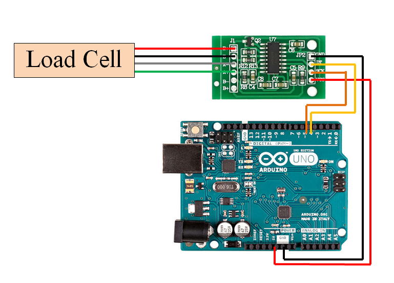
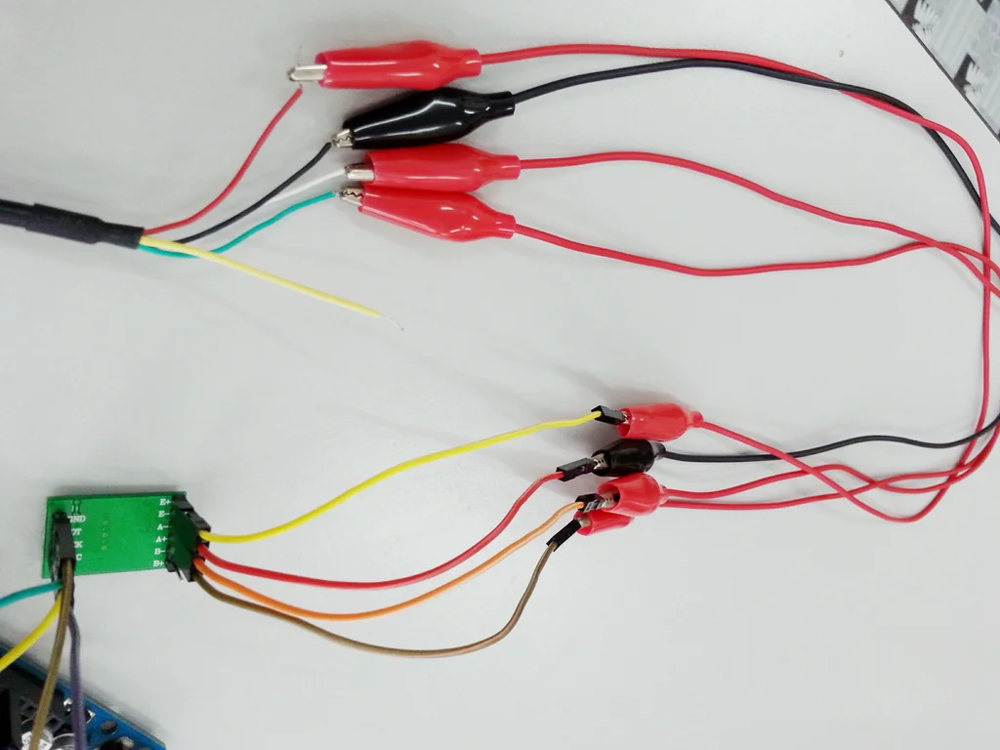
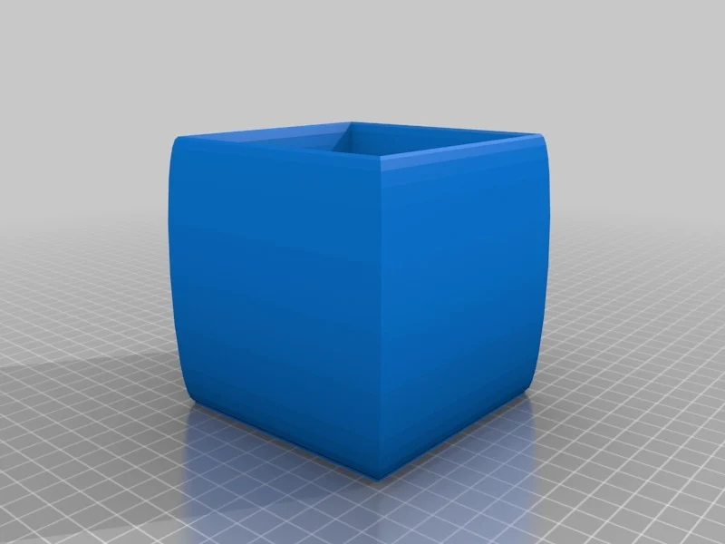
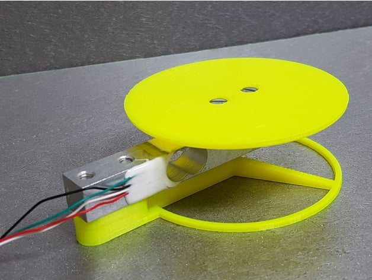

## Team Information
Group1: PillGate
##Team Members:
William Kasasa
Alperen Doganci
Emran Hamdard
Narjiss Hajjji
Manami Hayashi

## Project Overview
This Arduino project uses a load sensor to detect the weight of pills
(*We use a coin instead of a real pill due to the sensibility of the sensor for this prototype)

## Responsibilities
Development: Alperen Doganci
Reviewer: Manami Hayashi, Emran Hamdard, Narjiss Hajji, William Kassasa

## SoftwareSpecification
ArduinoIDE, C++

## Required Library
HX711

## HardwareSpecification
Arduino Uno board
HX711 load sensor (with male-female jumper wires and crocodile clip wires)
Serial Cable

## Other Material needed
PillBox
 3D printed TestBed
 Coin or pill
 You can find the images of the product and the testbed at below.

## Installation
1. Clone the main java application repository to your local machine. Extract the Arduino folder from the repository to your local machine.

2. Open the ArduinoIDE and load the project.

3. Connect the Arduino board to your computer via USB preferably on COM5.
 **IMPORTANT**: If you connect the Arduino on different port, you need to change the port number in the LoadSensorController file in the java code.

4. Set up the HX711 library.

5. Download the library to your Documents\Arduino\Libraries folder. Here you can keep the library as a zip.   Go to sketch in ArduinoIDE, click include library, then add .ZIP library, and select the hx711 library from your libraries folder.

6. Upload the code to the Arduino board by clicking verify and upload.

7. Click on the serial monitor at the top right to see the readings.

8. The serial monitor prints the data from the load sensor in this format:   Reading: X.XX grams calibration_factor: Y.YY.

9. You can adjust the calibration_factor based on the readings you received to measure the correct weight. E.g. “float calibration_factor = 730;”

10. Below is how to connect the load sensor to your Arduino and HX711 interface.

# How to set up the environment for the Arduino
## HX711 to Arduino Uno :
VCC to 5V
 
GND TO GND
 
DT TO D5
 
SCK to D6
 
## Load Cell to HX711
E+ : RED
 
E- : BLACK
 
A- : WHITE
 
A+ : GREEN

## Materials
### PillBox

### 3D printed TestBed
